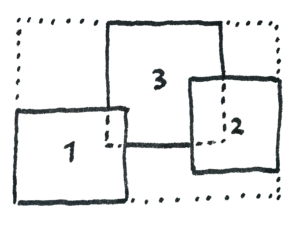
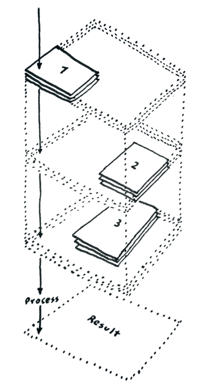
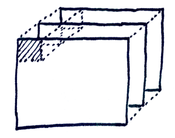

<p align="center">
  
</p>
<h1 align="center">StackComposed</h1>

StackComposed computes a per-pixel statistic over a stack of georeferenced raster images, such as a Landsat time series. Input images can cover different scenes, tiles, or partially overlapping areas. StackComposed builds one wrapper extent that covers all inputs, reads each processing chunk from every image, masks nodata values as `NaN`, and writes the selected statistic to a GeoTIFF.

Typical uses include computing median reflectance, counting valid observations, extracting the most recent valid pixel, returning the Julian day of a temporal statistic, or estimating a per-pixel linear trend from dated Landsat scenes.

## Core idea

For each output pixel, StackComposed builds a stack of values from all input images that overlap that pixel. The statistic is computed along the Z-axis only from valid values. Pixels outside an image footprint are treated as missing values.

The workflow is:

1. Discover input rasters from files or directories.
2. Validate that all inputs share projection, pixel size, and pixel registration.
3. Build the wrapper extent that covers all images.
4. Split the wrapper into chunks.
5. Read only the current chunk from every input image.
6. Apply the optional preprocessing filter.
7. Compute the statistic along the Z-axis.
8. Stream chunk results to the output GeoTIFF.

### Wrapper extent

The wrapper extent is the minimum bounding extent that covers all input images. Output dimensions are derived from this extent and the input pixel size.



### Data cube by chunk

For each chunk, StackComposed reads the corresponding window from every image and arranges the values as a small data cube: rows, columns, and depth (Z-axis). The statistic is computed along the Z-axis for every pixel in that chunk.



### Local parallel processing

StackComposed processes chunks in local worker processes. The main process is the only writer, which avoids concurrent writes to the output file. Use `-p 1` for single-process execution or `-p N` for local parallelism.



Distributed execution is not available in the current release; use `-p` for local worker processes.

## Installation

StackComposed requires:

- Python 3.9 or newer
- NumPy
- Rasterio
- Dask

Rasterio depends on GDAL. The most reliable installation path is usually Conda or another environment that installs Rasterio and GDAL together.

### Conda plus pip

```bash
conda install -c conda-forge numpy rasterio dask
pip install git+https://github.com/SMByC/StackComposed
```

### UV tool install

```bash
uv tool install git+https://github.com/SMByC/StackComposed
```

### UV project environment

```bash
uv pip install git+https://github.com/SMByC/StackComposed
```

## Input requirements

All input rasters must:

- use the same projection
- use the same pixel size
- be aligned to the same pixel grid
- have at least the requested band number

At least two images are required after optional date filtering.

Supported input extensions are:

- `.tif`
- `.img`
- `.hdr` for ENVI datasets

Directory inputs are searched recursively for supported files.

## Important: mask your input nodata

StackComposed relies on nodata metadata to distinguish valid pixels from missing observations along the Z-axis. If your rasters do not declare a nodata value, set it explicitly with `-nodata` — otherwise pixels that should be ignored (background, fill, or out-of-scene areas) will enter the statistic as real values and skew the result. For example, a `0` fill value in a reflectance raster will drag the mean down, inflate the valid pixel count, and corrupt any trend estimate. Always confirm that each input either has a correct nodata value in its metadata or supplies one through `-nodata` before running the statistic.

## Command line usage

```bash
stack-composed -stat STAT -bands BANDS [OPTIONS] INPUT [INPUT ...]
```

Common examples:

```bash
# Median of band 1 from all rasters in a directory
stack-composed -stat median -bands 1 -o /output/dir /path/to/images/

# Mean of bands 1, 2, and 3 using 8 local workers and 500 px chunks
stack-composed -stat mean -bands 1,2,3 -p 8 -chunks 500 -o /output/result.tif /images/

# Only include Landsat-style filenames in a date range
stack-composed -stat max -bands 1 -start 2020-01-01 -end 2022-12-31 -o /out/ /images/

# Keep only values in [1, 5] before computing the sum
stack-composed -stat sum -bands 1 -preproc '>=1 and <=5' -o /out/ /images/

# Linear trend output is scaled by 1e6 and written as int32 by default
stack-composed -stat linear_trend -bands 1 -o /out/ /landsat-scenes/
```

## Options

| Option | Required | Default | Description |
|--------|----------|---------|-------------|
| `-stat STAT` | yes | - | Statistic to compute. See [Statistics](#statistics). |
| `-bands BANDS` | yes | - | Band number or comma-separated band list, for example `1` or `1,2,3`. |
| `-preproc EXPR` | no | none | Preprocessing filter applied before the statistic. See [Preprocessing](#preprocessing). |
| `-nodata VALUE` | no | file nodata | Treat this input pixel value as nodata. Overrides file metadata. |
| `-o PATH` | no | current directory | Existing output directory or explicit `.tif` file path. |
| `-ot DTYPE` | no | automatic | Force output dtype: `int8`, `uint16`, `uint32`, `int16`, `int32`, `float32`, or `float64`. |
| `-p N` | no | CPU cores minus one | Number of local worker processes. Use `-p 1` to disable parallel processing. |
| `-chunks PX` | no | `1000` | Chunk size in pixels. Larger chunks reduce overhead but use more memory. |
| `-start YYYY-MM-DD` | no | none | Include only images on or after this date. Requires parseable Landsat metadata. |
| `-end YYYY-MM-DD` | no | none | Include only images on or before this date. Requires parseable Landsat metadata. |
| `INPUT` | yes | - | One or more input files or directories. |

## Output files

If `-o` is an existing directory, StackComposed writes standard names:

```text
stack_composed_<stat>_band<band>.tif
```

Example:

```text
stack_composed_median_band1.tif
```

If `-o` is an explicit `.tif` path and one band is requested, that file is used directly.

If `-o` is an explicit `.tif` path and multiple bands are requested, StackComposed suffixes each output to avoid overwriting earlier bands:

```text
result_band1.tif
result_band2.tif
result_band3.tif
```

For `linear_trend`, standard output names include `x1e6` because the slope is multiplied by 1,000,000 before writing:

```text
stack_composed_linear_trend_x1e6_band1.tif
```

## Statistics

| Statistic | Output meaning | Notes |
|-----------|----------------|-------|
| `median` | Median of valid values | Ignores nodata/NaN. |
| `mean` | Arithmetic mean | Ignores nodata/NaN. |
| `gmean` | Geometric mean | Uses positive values only. |
| `sum` | Sum of valid values | Returns nodata/NaN when all observations are invalid. |
| `max` | Maximum valid value | Ignores nodata/NaN. |
| `min` | Minimum valid value | Ignores nodata/NaN. |
| `std` | Standard deviation | Ignores nodata/NaN. |
| `valid_pixels` | Count of valid observations | Output dtype is `uint8` when possible, otherwise `uint16`. |
| `last_pixel` | Pixel value from the most recent valid dated image | Requires [filename metadata](#filename-metadata). |
| `jday_last_pixel` | Julian day of the most recent valid dated image | Requires [filename metadata](#filename-metadata). |
| `jday_median` | Julian day of the temporal median position | Requires [filename metadata](#filename-metadata). |
| `linear_trend` | Ordinary least squares slope multiplied by 1e6 | Requires [filename metadata](#filename-metadata). Default output dtype is `int32`. |
| `extract_NN` | `NN` where at least one observation equals `NN`, otherwise nodata/NaN | Extracts the value `NN` from the stack. Any other value becomes nodata/NaN. Example: `extract_2`. |
| `percentile_NN` | `NN`th percentile | `NN` must be in `[0, 100]`. Example: `percentile_25`. |
| `trim_mean_LL_UL` | Mean after keeping values between percentiles `LL` and `UL` | Bounds must be in `[0, 100]` and `LL <= UL`. Example: `trim_mean_10_90`. |

`jday_last_pixel` and `jday_median` write `0` where a pixel has no valid dated observation.

### Automatic output data types

When `-ot` is omitted, StackComposed selects an output data type from the statistic and inputs:

| Statistic group | Default dtype |
|-----------------|---------------|
| `max`, `min`, `last_pixel` | Input dtype |
| `sum` | `float64` if the input is `float64`, otherwise `float32` (avoids integer overflow) |
| `jday_last_pixel`, `jday_median` | `uint16` |
| `median`, `mean`, `gmean`, `std`, `extract_NN`, `percentile_NN`, `trim_mean_LL_UL` | `float64` if the input is `float64`, otherwise `float32` |
| `valid_pixels` | `uint8` for fewer than 256 images, otherwise `uint16` |
| `linear_trend` | `int32` |

## Preprocessing

Preprocessing is applied to each pixel's stack of values before the statistic. Values that fail the preprocessing condition become nodata/NaN for the statistic. Enter the expression as a string in the `-preproc` argument.

| Expression | Meaning | Example |
|------------|---------|---------|
| `>N`, `>=N`, `<N`, `<=N`, `==N`, `!=N` | Keep values matching a comparison | `-preproc '>0'` |
| `>A and <B` | Keep values matching both comparisons | `-preproc '>=1 and <=5'` |
| `percentile_LL_UL` | Keep values between per-pixel percentile bounds | `-preproc percentile_10_90` |
| `NN_std_devs` | Keep values within `NN` standard deviations of the per-pixel mean | `-preproc 2.5_std_devs` |
| `NN_IQR` | Keep values within `NN` interquartile ranges of the per-pixel median | `-preproc 1.5_IQR` |

Only `and` is supported for compound comparison expressions.

Practical preprocessing examples:

- Mask invalid reflectance values before computing a mean or median, for example `-preproc '>0 and <=10000'` for scaled optical reflectance products.
- Remove outliers along the stack before a summary statistic, for example `-preproc percentile_10_90` to keep the central 80% of each pixel's stack of values.
- Keep values near the local distribution along the stack before trend estimation, for example `-preproc 2.5_std_devs` to reduce the effect of extreme cloud, shadow, or sensor artifacts.

## Chunk size and workers

The chunk size controls how much raster data each worker loads at once. For one chunk, memory is roughly proportional to:

```text
chunk_rows * chunk_cols * number_of_overlapping_images
```

General guidance:

- Increase `-chunks` when processing overhead dominates and memory is available.
- Decrease `-chunks` when memory pressure is high.
- Increase `-p` only when enough memory exists for several chunks at once.
- Use `-p 1` for debugging or for machines with limited memory.

The chunk size is clamped to the wrapper dimensions when the requested chunk is larger than the output raster.

## Filename metadata

The following options and statistics require date metadata parsed from filenames:

- `-start`
- `-end`
- `last_pixel`
- `jday_last_pixel`
- `jday_median`
- `linear_trend`

Supported Landsat filename styles include:

### Old Landsat IDs

```text
LC80070592016320LGN00_band1.tif
LE70070592003123LGN00_band1.tif
```

### New Landsat product IDs

```text
LC08_L1TP_007059_20161115_20170318_01_T2_b1.tif
LE07_L1TP_007059_20030503_20160928_01_T1_b1.tif
```

### SMByC Landsat filenames

```text
Landsat_8_53_020601_7ETM_Reflec_SR_Enmask.tif
Landsat_8_53_020823_7ETM_Reflec_SR_Enmask.tif
```

StackComposed extracts Landsat version, sensor, path, row, acquisition date, and Julian day from these patterns.

## About

StackComposed was designed and developed by the Forest and Carbon Monitoring System group (SMByC), operated by the Institute of Hydrology, Meteorology and Environmental Studies (IDEAM) — Colombia.

**Author and developer:** Xavier C. Llano <xavier.corredor.llano@gmail.com>  
**Theoretical support, testing and product verification:** SMByC-PDI group

## License

StackComposed is free/libre software, licensed under the GNU General Public License v3 (GPLv3).
