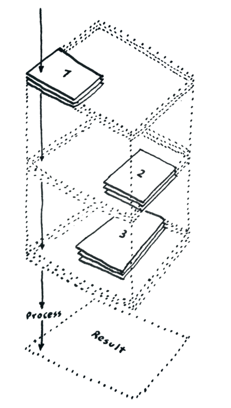
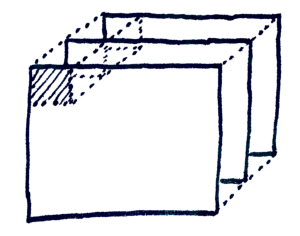

# StackComposed

The StackComposed compute the stack composed of a specific statistic of band values for several time series of
georeferenced data (such as Landsat images), even if these are in different scenes or tiles. The result is a output of
statistic compute for all valid pixels values across the time axis (z-axis), in the wrapper extent for all input data in
parallels process.

The main aim of this app are:

* Improve the velocity of compute the stack composed

* Compute several statistics in the stack composed easily.

* Compute a stack composed for data in different position/scenes using a wrapper extent.

* Include the overlapping areas for compute the statistics, e.g. two adjacent scenes with overlapping areas.

* Compute some statistics that depend of time data order (such as last valid pixel, pearson correlation) using the
  filename for parse metadata (for now only for Landsat images)

## Process flow

The general process flow is:

* Read all input data (but not load the raster in memory)

* Calculate the wrapper extent for all input data

* Position each data in the wrapper extent (the app does not exactly do this, use a location for extract the chunk in
  the right position in wrapper, this is only for understand the process)

* Make the calculation of the statistic in parallel process by chunks

* Save result with the same projection with the wrapper extent

### Compute the wrapper extent

The wrapper extent is the minimum extent that cover all input images, in this example there are 3 scenes of the images
with different position, the wrapper extent is shown in dotted line:


The wrapper extent is the size for the result.

### Data cube process

With the wrapper extent then the images are located in a right position in it and put all images in a stack for process,
the images are ordered across the time like a cube or a 3D matrix. When compute a statistic, it process all pixel for
the wrapper extent, first extract all pixel values in all images in their corresponding position across the z-axis, for
some images this position don't have data, then it return a NaN value that is not included for the statistic.



### Parallelization

There are mainly two problems for serial process (no parallel):

- When are several images (million of pixels) required a lot of time for the process
- For load several images (data cube) for process required a lot of ram memory for do it

For solved it, the StackComposed divide the data cube in equal chunks, each chunks are processes in parallel depends of
the number of process assigned. When one chunk is being process, it load only the chunk part for all images and not load
the entire image for do it, with this the StackComposed only required a ram memory enough only for the sizes and the
number of chunks that are currently being processed in parallel.



## How to use

This is a mini guide step by step for use the StackComposed

### Recommendation for data input

There are some recommendation for the data input for process, all input images need:

- To be in the same projection
- Have the same pixel size
- Have pixel registration

For the moment, the image formats support are: `tif`, `img` and `ENVI` (hdr)

### Usage

`StackComposed` takes some command-line options:

```bash
stack-composed -stat STAT -preproc PREPROC -bands BANDS [-p P] [-chunks CHUNKS] [-start DATE] [-end DATE] [-o OUTPUT] 
[-ot dtype] inputs
```

- `-stat` STAT (required)
    - statistic for compute the composed along the time axis ignoring any nans, this is, compute the statistic along the
      time series by pixel.
    - statistics options:
        - `extract_NN`: extract from the inputs the value NN, any other value will be ignored, overlapped values NN
          remain NN, for example, for to extract the value 2 put "extract_2"
        - `median`: compute the median
        - `mean`: compute the arithmetic mean
        - `gmean`: compute the geometric mean, that is the n-th root of (x1 * x2 * ... * xn)
        - `max`: compute the maximum value
        - `min`: compute the minimum value
        - `std`: compute the standard deviation
        - `valid_pixels`: compute the count of valid pixels
        - `last_pixel`: return the last _valid_ pixel base on the date of the raster image, required filename as
          metadata [(extra metadata)](#filename-as-metadata)
        - `jday_last_pixel`: return the julian day of the _last valid pixel_ base on the date of the raster image,
          required filename as metadata [(extra metadata)](#filename-as-metadata)
        - `jday_median`: return the julian day of the median value base on the date of the raster image, required
          filename as metadata [(extra metadata)](#filename-as-metadata)
        - `percentile_nn`: compute the percentile nn, for example, for percentile 25 put "percentile_25" (must be in the
          range 0-100)
        - `trim_mean_LL_UL`: compute the truncated mean, first clean the time pixels series below to percentile LL (
          lower limit) and above the percentile UL (upper limit) then compute the mean, e.g. trim_mean_25_80. This
          statistic is not good for few time series data
        - `linear_trend`: compute the linear trend (slope of the line) using least-squares method of the valid pixels
          time series ordered by the date of images. The output by default is multiply by 1000 in signed integer.
          required filename as metadata [(extra metadata)](#filename-as-metadata)
    - example: -stat median

- `-preproc` PREPROC (optional)
    - pre-processing the input data to define the valid data and clean from outliers before compute the statistic
    - preprocesing options:
        - `less_than_NN`: define the valid data less than NN value and remove outside this limit, for example, for
          define the valid data less than 1000 put "less_than_1000"
        - `greater_than_NN`: define the valid data greater than NN value and remove outside this limit, for example, for
          define the valid data greater than 0 put "greater_than_0"
        - `between_LL_UL`: define the valid data between LL and UL values and remove outside this limit, for example,
          for
          define the valid data between 0 and 1000 put "between_0_1000"
        - `percentile_LL_UL`: define the valid data between the percentile LL and UL values and remove outside this
          limit,
          for example, for define the valid data between the percentile 25 and 75 put "percentile_25_75"
        - `NN_std_devs`: define the valid data between the mean minus and plus NN standard deviations and remove
          outside this limit, for example, for define the valid data between the mean minus and plus 2.5 standard
          deviations put "2.5_std_devs"
        - `NN_IQR`: define the valid data between the NN IQR (interquartile range) and remove outside this limit,
          for example, for define the valid data between the 1.5 IQR put "1.5_IQR"
    - example: -preproc less_than_1000
  
- `-bands` BANDS (required)
    - band or bands to process
    - input: integer or integers comma separated
    - example: -bands 1,2,4

- `-nodata` NODATA (optional)
    - input pixel value to treat as nodata
    - input: integer, float or string
    - example: -nodata 0 (or: "<0", ">=0", "<0 or >1", ">=0 or <=1")

- `-p` P (optional)
    - number of process
    - input: integer
    - by default: total cores - 1
    - example: -p 10

- `-chunks` CHUNKS (optional)
    - chunks size for parallel process [(chunks sizes)](#chunks-sizes)
    - input: integer
    - by default: 1000
    - example: -chunks 800

- `-o` OUTPUT (optional)
    - output directory and/or filename for save results
    - input: string, absolute or relative path or filename
    - by default: save in the same directory of run with a standard name
    - example: -o /dir/to/file.tif

- `-ot` DTYPE (optional)
    - output data type for results
    - options: byte, uint16, uint32, int16, int32, float32, float64
    - example: -ot float64

- `-start` DATE (optional)
    - filter the images with the start date DATE, can be used alone or in combination with -end argument, required
      filename as metadata [(extra metadata)](#filename-as-metadata)
    - format: YYYY-MM-DD
    - example: -start 2016-06-01

- `-end` DATE (optional)
    - filter the images with the end date DATE, can be used alone or in combination with -start argument, required
      filename as metadata [(extra metadata)](#filename-as-metadata)
    - format: YYYY-MM-DD
    - example: -end 2016-12-31

- `inputs` (required)
    - directories or images files to process
    - input: filenames and/or absolute or relative directories
    - example: /dir1 /dir2 *.tif

#### Chunks sizes

Choosing good values for chunks can strongly impact performance. StackComposed only required a ram memory enough only
for the sizes and the number of chunks that are currently being processed in parallel, therefore the chunks sizes going
together with the number of process. Here are some general guidelines. The strongest guide is memory:

- The size of your blocks should fit in memory.

- Actually, several blocks should fit in memory at once, assuming you want multi-core

- The size of the blocks should be large enough to hide scheduling overhead, which is a couple of milliseconds per task

#### Filename as metadata

Some statistics or arguments required extra information for each image to process. The StackComposed acquires this extra
metadata using parsing of the filename. Currently support two format:

* **Official Landsat filenames:**
    * Example:
        * LE70080532002152EDC00...tif
        * LC08_L1TP_007059_20161115...tif


* **SMByC format:**
    * Example:
        * Landsat_8_53_020601_7ETM...tif

For them extract: landsat version, sensor, path, row, date and julian day.

## Issue Tracker

Issues, ideas and
enhancements: [https://github.com/SMByC/StackComposed/issues](https://github.com/SMByC/StackComposed/issues)

## About us

StackComposed was developing, designed and implemented by the Group of Forest and Carbon Monitoring System (SMByC),
operated by the Institute of Hydrology, Meteorology and Environmental Studies (IDEAM) - Colombia.

Author and developer: *Xavier C. Llano*  
Theoretical support, tester and product verification: SMByC-PDI group

### Contact

Xavier C. Llano: *xavier.corredor.llano@gmail.com*  
SMByC: *smbyc (a) ideam.gov.co*

## License

StackComposed is a free/libre software and is licensed under the GNU General Public License.
